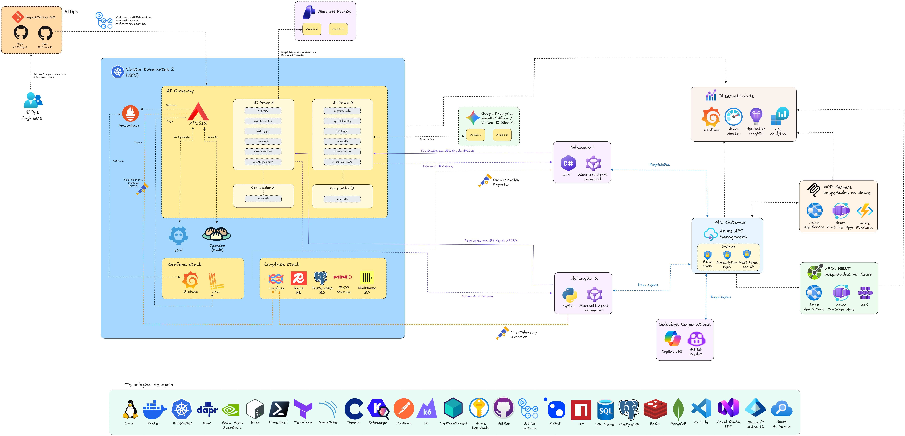

# arquitetura-ia-mcps-apis-aigateway_2026-10
Exemplo de arquitetura de referência para soluções de IA utilizando MCPs, Azure API Management (APIM), APISIX, Grafana, Kubernetes e IAs Generativas.

Diagrama com uma proposta de arquitetura:

